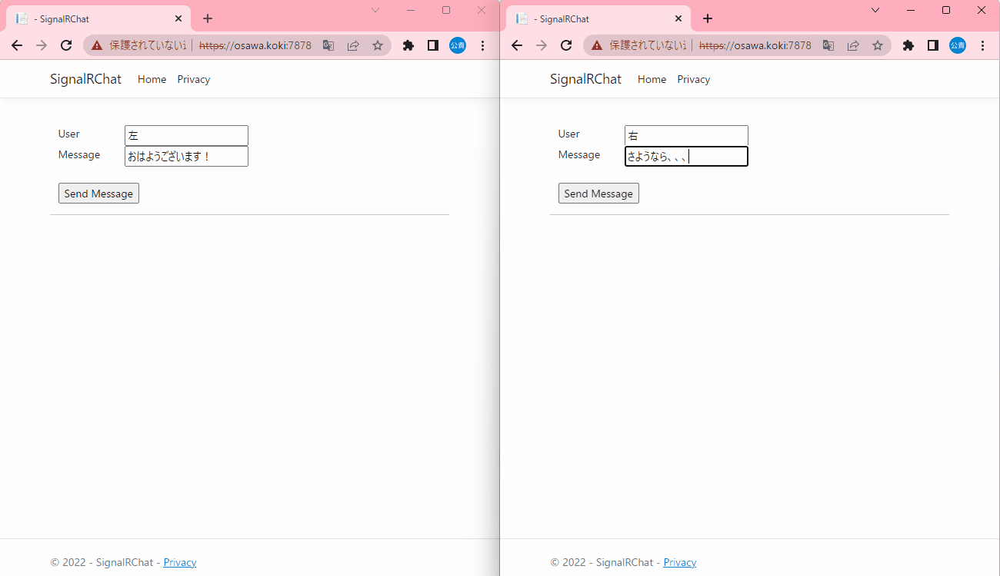

# SignalRChat

SignalR(ASP.NET)のマイクロソフト公式チュートリアルに沿って作成した学習目的プロジェクト。

  

## 実行方法

```shell
docker build -t signalr-chat .
docker run -p 80:7777 -it --rm --name my-signalr-chat signalr-chat

# 一行で書くなら、、、
docker build -t signalr-chat . && docker run -p 80:7777 -it --rm --name my-signalr-chat signalr-chat
```

## 開発環境

| 機能 | バージョン |
| ---- | ---- |
| Windows | 11 Home |
| Visual Studio | 2022 |
| .NET | 6.0 |
| C# | .NET依存 |

## デプロイ設定(Render.com)

| キー | バリュー |
| ---- | ---- |
| Name | signalr-chat |
| Region | Oregon(US West) |
| Branch | main |
| Root Directory |  |
| Environment | Docker |
| Dockerfile Path | ./Dockerfile |
| Docker Build Context Directory |  |
| Docker Command |  |

## 参考資料(目を通しておきたい資料)

- [対象チュートリアル](https://learn.microsoft.com/ja-jp/aspnet/core/tutorials/signalr?view=aspnetcore-6.0&tabs=visual-studio)

Visual Studioに関する詳細。  
プロジェクト作成時の初期画面に表示されて、気になったからメモ。  

- <https://learn.microsoft.com/ja-jp/visualstudio/ide/csharp-developer-productivity?utm_source=VisualStudio&utm_medium=aspnet-getstarted&utm_campaign=VisualStudio&view=vs-2022>
- [コード エディターの機能](https://learn.microsoft.com/ja-jp/visualstudio/ide/writing-code-in-the-code-and-text-editor?utm_source=VisualStudio&utm_medium=aspnet-getstarted&utm_campaign=VisualStudio&view=vs-2022#generate-fix-or-refactor-code)
